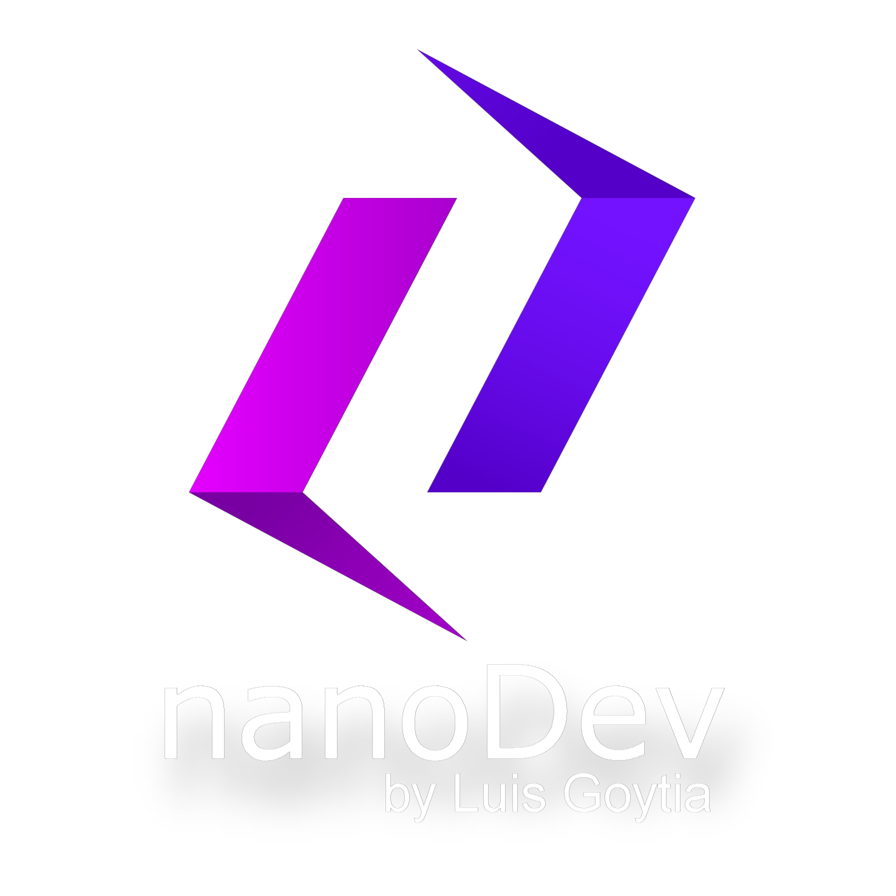

<h1 align="center">Hola, yo soy Luis Goytia👋👨🏽‍💻</h1>
<h3 align="center">Full Stack Web Developer con tendencia al Back End ♥️</h3>

- 💬 ¿Quién soy? **Soy una persona comprometida con lo que hace, responsable, flexible al entorno, buen comunicador y con constante tendencia a la autosuperación para lograr ser el desarrollador que quiero ser.**

- 💻 ¿Dónde puedo ver tus proyectos? Cooming soon..

- 🌱 ¿Qué estas estudiando? **Actualmente estoy investigando sobre TypeScript, GraphQL y NextJS.**

- 🎦 ¿Qué hobbies tengo? **Me gusta mucho cocinar, el fútbol, jugar juegos y natacion como deporte principal.**

- 📫 ¿Cómo me puedes contactar? Puedes hacerlo a través de mi mail **luis.goytia.it@gmail.com** 

- 📫 Tambien puedes hacerlo a través del mail **hi.nanodev@gmail.com** 

<h3 align="left">Otros medios de contacto: </h3>

<h3 align="left">Lenguajes y herramientas:</h3>

   

 
   
 

   

