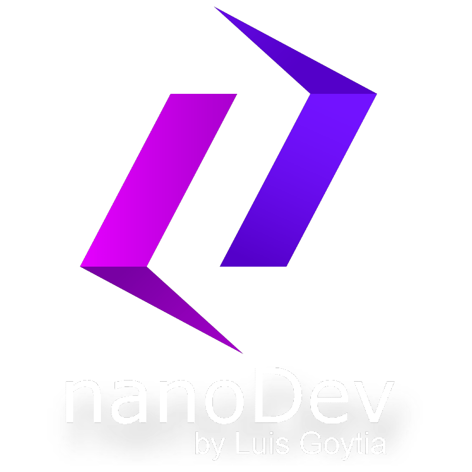

<!---->

<h1 align="center">¡Hola, Soy Luis Goytia! 👋👨🏽‍💻</h1>
<h3 align="center">Desarrollador Web Full Stack</h3>

- 💬 **¿Quién soy?** Desarrollador fullstack con énfasis
en Backend. Durante 2 años, me he
especializado en Node.js,
centrándome en el desarrollo web y
la implementación de chatbots con
IA. Destaco por mi capacidad para
resolver problemas de forma rápida
y dinámica, adaptándome
ágilmente a cualquier desafío que
se presente.

- 🤖 **¿Qué estoy trabajando actualmente?** Desarrollando chatbots con integracion de Servicios de Openai y los servicios de Azure para la implementacion de otros modelos.
Usando tecnologias como : Nestjs, AWS, Azure Y WhatsApp API.

- 💻 **¿Dónde puedo ver tus proyectos?**   [luiscabezas.vercel.app](https://luiscabezas.vercel.app/) 

- 🌱 **¿Qué estoy estudiando?** Actualmente estoy investigando sobre Nestjs, LangChain y Python.

- 📫 **¿Cómo me puedes contactar?** Puedes hacerlo a través de mi correo electrónico: **luisgoytia.dev@gmail.com** 
<h3 align="left">Otros medios de contacto: </h3>

## Conocimientos Específicos

### Nest.js

[Nest.js](https://nestjs.com/) es un marco de trabajo progresivo de Node.js para construir aplicaciones escalables y eficientes en el lado del servidor. He utilizado Nest.js en varios proyectos para desarrollar APIs robustas y mantenibles.

### OpenAI

Me especializo en el uso de [OpenAI](https://openai.com/) para integrar inteligencia artificial en aplicaciones y sistemas. He trabajado con la API de OpenAI para desarrollar soluciones innovadoras, desde chatbots hasta sistemas de generación de texto avanzados.

<h3 align="left">Tecnologías y Herramientas:</h3>

   

 
   
 

   

---

¡Gracias por visitar mi repositorio!

